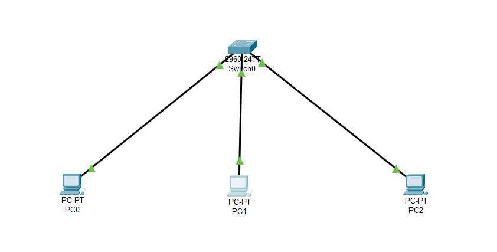
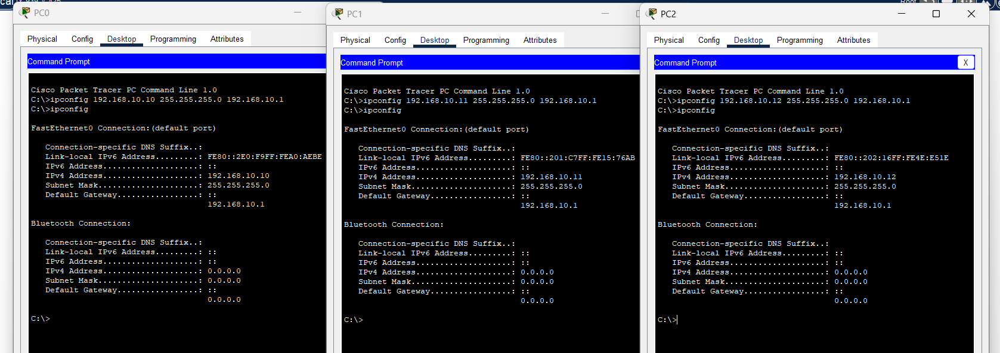
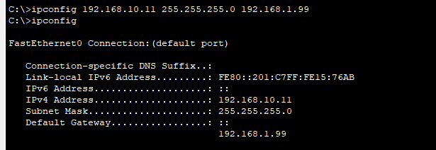
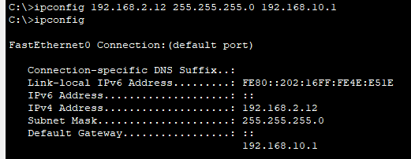
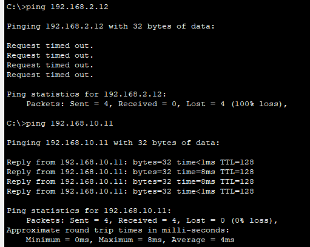
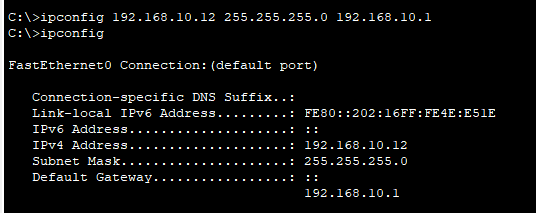
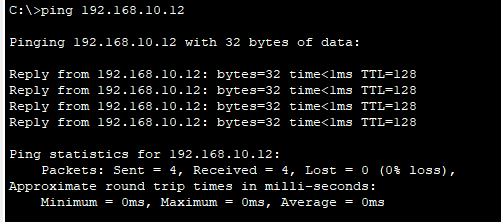

#  Network Troubleshooting and Diagnostics Lab

## Project Overview
This project demonstrates practical network troubleshooting and diagnostics techniques using Cisco Packet Tracer. The lab simulates common network configuration issues such as incorrect IP addressing and gateway misconfigurations, followed by systematic diagnosis and resolution using networking tools and connectivity testing.

---

## Features
- Simulated real-world network connectivity problems
- Diagnosed incorrect IP and gateway configurations
- Performed connectivity testing using ping
- Used troubleshooting methods to identify network failures
- Restored network communication by correcting misconfigurations
- Documented troubleshooting procedures and solutions

---

## Technologies and Tools
- Cisco Packet Tracer
- TCP/IP Networking
- Ping
- IP Configuration Tools
- Network Troubleshooting Techniques

---

## Project Files
- network-troubleshooting-lab.pkt → Cisco Packet Tracer simulation file
- assets/ → Project screenshots and troubleshooting evidence

---

## Project Screenshots

### 🔷 Network Topology

---

### 🔷 Initial IP Address Configuration

---

### 🔷 Break Scenario 1 – Incorrect Gateway Configuration

---

### 🔷 Break Scenario 2 – Incorrect IP Address Configuration

---

### 🔷 Troubleshooting and Diagnostics

---

### 🔷 Fixing Network Configuration Issues

---

### 🔷 Connectivity Test After Fix

---

## Learning Outcomes
This project demonstrates practical skills in:
- Network troubleshooting
- IP addressing and subnetting
- Connectivity diagnostics
- Problem identification and resolution
- Basic enterprise network support operations

---

## Author
Chandupa Silva  
Network Engineering Student (UCSC)
